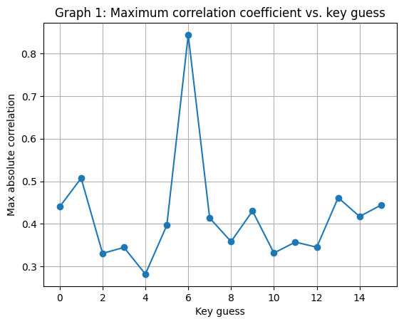
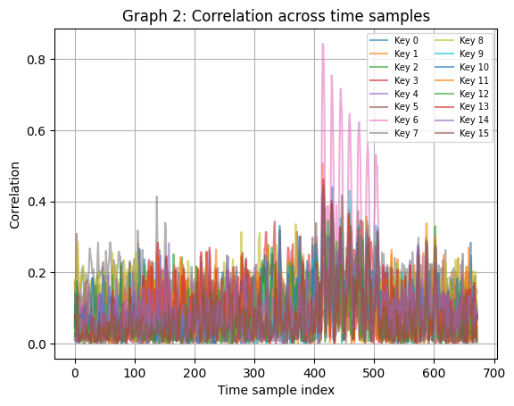
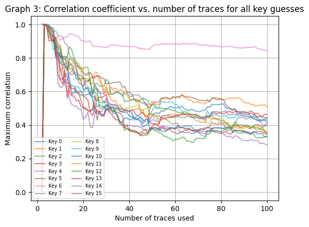
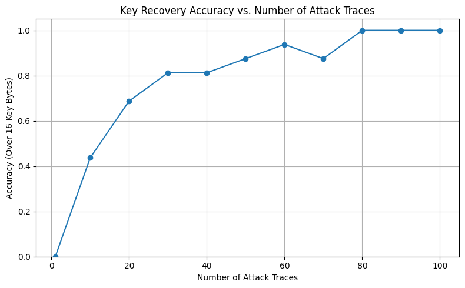
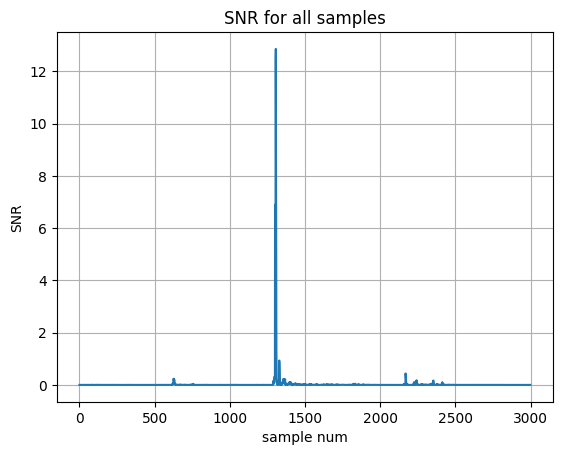
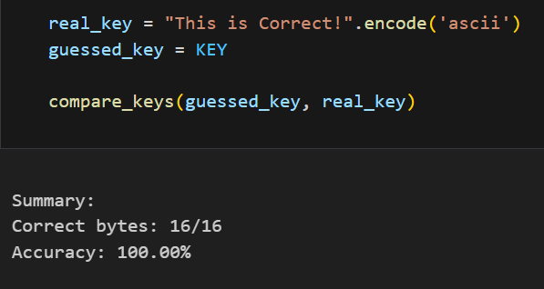

# ChipWhisperer Side-Channel Attacks (CPA + DPA + Template Attack)

This repository demonstrates practical side-channel attacks on AES using the ChipWhisperer platform.
It includes three end-to-end notebooks covering **CPA**, **DPA**, and a **Template (Profiling) Attack**,
with trace analysis, POI selection, and key/secret recovery evaluation.

Developed as part of an advanced hardware security course project.

## Tech Stack
- Python
- ChipWhisperer
- NumPy / SciPy
- Matplotlib
- Jupyter Notebook

## Repository Structure

```
.
├─ notebooks/
│ ├─ CPA_attack.ipynb
│ ├─ DPA_attack.ipynb
│ └─ Template_attack.ipynb
├─ figures/
│ ├─ cpa_max_corr_vs_key_guess.png
│ ├─ cpa_corr_across_time_samples.png
│ ├─ cpa_max_corr_vs_traces.png
│ ├─ dpa_recovered_id_match.png
│ ├─ template_accuracy_vs_traces.png
│ ├─ template_snr_byte0.png
│ └─ template_key_recovery_16of16.png
├─ requirements.txt
└─ README.md
```

## Notebooks

### 1) `notebooks/CPA_attack.ipynb`
Implements a **Correlation Power Analysis (CPA)** attack on AES.
The notebook evaluates correlation across time samples and key hypotheses, and demonstrates how the
attack improves as more traces are used.

### 2) `notebooks/DPA_attack.ipynb`
Implements a **Differential Power Analysis (DPA)**-style recovery experiment,
showing successful recovery of secret key material from power traces.

### 3) `notebooks/Template_attack.ipynb`
Implements a **Template Attack (Profiling Attack)** on AES:
- Computes SNR and selects **Points of Interest (POIs)** (example shown for Byte 0)
- Builds templates from profiling traces
- Recovers the full key and evaluates success rate vs. number of attack traces

---

## Results

### CPA Attack
**Max correlation vs. key guess**



**Correlation across time samples**



**Max correlation vs. number of traces**



---

### DPA Attack
**Recovered secret verification**


---

### Template Attack
**Key recovery accuracy vs. number of attack traces**



**SNR curve for POI selection (example: Byte 0)**



**Final key recovery summary (16/16 bytes)**



---

## How to Run
To reproduce the experiments you will need access to the ChipWhisperer setup and the corresponding trace data.
Open the notebooks under `notebooks/` and run the cells in order.
